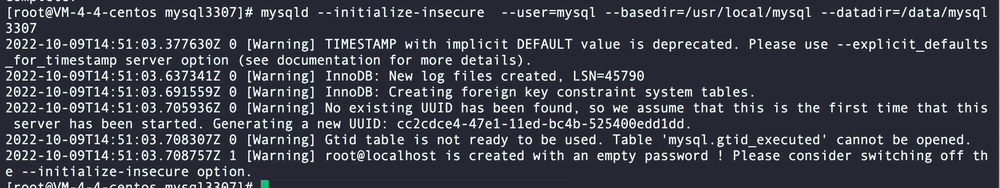
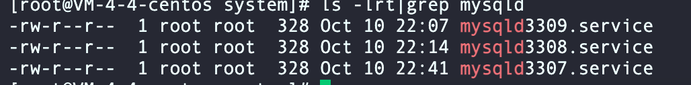

>   MySQL 手册关于 MySQL 安装与升级：[MySQL :: MySQL 8.0 Reference Manual :: 2 Installing and Upgrading MySQL](https://dev.mysql.com/doc/refman/8.0/en/installing.html)


如何在 Linux 上安装 MySQL 程序？[MySQL :: MySQL 8.0 Reference Manual :: 2.2 Installing MySQL on Unix/Linux Using Generic Binaries](https://dev.mysql.com/doc/refman/8.0/en/binary-installation.html)

1.   下载 MySQL 的通用二进制文件，并上传到`/usr/local`

     ```shell
     cd /usr/local
     tar zxvf /path/to/mysql-VERSION-OS.tar.xz
     ln -s full-path-to-mysql-VERSION-OS mysql
     ```

2.   创建 mysql 用户

     ```shell
     groupadd mysql
     useradd -r -g mysql -s /bin/false mysql
     ```

3.   配置环境变量

     ```shell
     vim /etc/profile
     export PATH=$PATH:/usr/local/mysql/bin
     
     source /etc/profile
     ```


安装完 MySQL 程序，如何进行安装后的设置和测试？[MySQL :: MySQL 8.0 Reference Manual :: 2.10 Postinstallation Setup and Testing](https://dev.mysql.com/doc/refman/8.0/en/postinstallation.html)


## 初始化数据目录

1.   创建 MySQL 数据目录，并赋予权限

     ```shell
     mkdir -p /data/mysql
     chown mysql:mysql /data/mysql
     chmod 750 /data/mysql
     ```

2.   执行 MySQL 初始化命令`mysqld --initialize-insecure  --user=mysql --basedir=/usr/local/mysql --datadir=/data/mysql`

其中 --initialize-insecure 不设置默认密码，也不遵循 MySQL 的密码规范，生产环境必须这么来初始化。



>   更详细的参考文档：[MySQL :: MySQL 8.0 Reference Manual :: 2.10.1 Initializing the Data Directory](https://dev.mysql.com/doc/refman/8.0/en/data-directory-initialization.html)


## 配置 MySQL 服务启停

>   参考官方文档：[MySQL :: MySQL 8.0 Reference Manual :: 2.5.9 Managing MySQL Server with systemd](https://dev.mysql.com/doc/refman/8.0/en/using-systemd.html)

```shell
vim /etc/systemd/system/mysqld.service 

[Unit]
Description=MySQL Server
Documentation=man:mysqld(8)
Documentation=http://dev.mysql.com/doc/refman/en/using-systemd.html
After=network.target
After=syslog.target
[Install]
WantedBy=multi-user.target
[Service]
User=mysql
Group=mysql
ExecStart=/app/mysql/bin/mysqld --defaults-file=/etc/my.cnf
LimitNOFILE = 5000

# 记得编辑保存完前面的内容，可能需要执行以下的命令
systemctl daemon-reload
```

>   如果想多实例启动 MySQL，只需要改动这里 ExecStart=/app/mysql/bin/mysqld --defaults-file=/etc/my.cnf 即可


之后就可以通过 systemctl *{start|stop|restart|status}* mysqld 来启停 mysqld 服务了。

在这里我配置了三台 MySQL 服务器实例，可以 systemctl *{start|stop|restart|status}* mysqld3307.service 来启动端口为 3307 的 MySQL 服务器。

